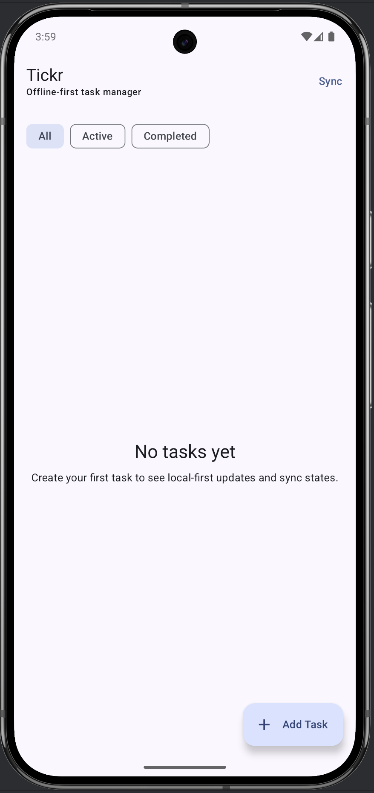
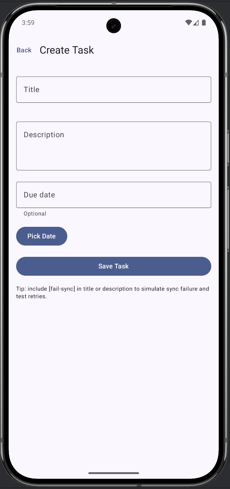
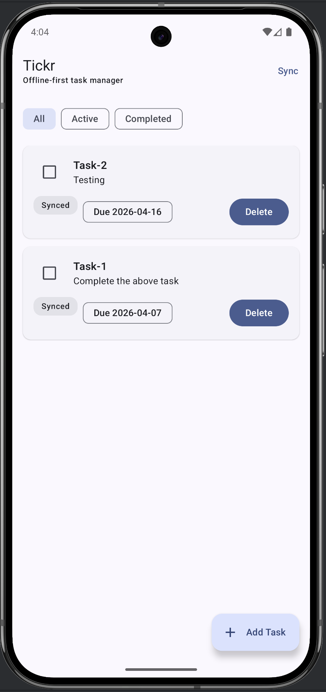
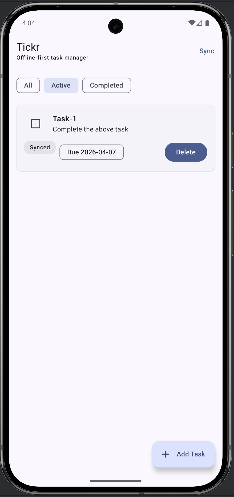
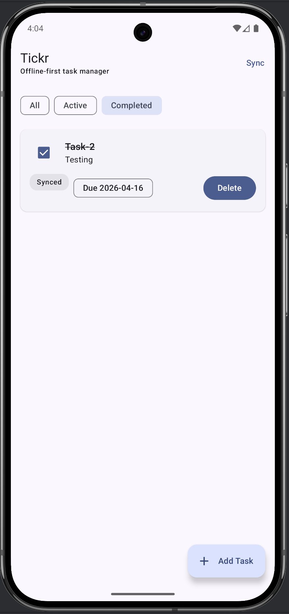

# Tickr

Tickr is an offline-first Android task management app built with Kotlin and Jetpack Compose to demonstrate production-style Android architecture.

It is designed as an interview-ready project that showcases how to build a local-first app with Room as the single source of truth, reactive UI using Flow/StateFlow, and resilient background sync using WorkManager.

<p align="center">
  
  
  
</p>

<p align="center">
  
  
</p>


## Tech Stack

- Kotlin
- Jetpack Compose
- MVVM
- Room
- Repository Pattern
- Flow / StateFlow
- WorkManager
- Material 3

## Features

- Create, edit, complete, and delete tasks
- Filter tasks by All, Active, and Completed
- Offline-first local persistence with Room
- Reactive task streams using Flow
- Sync states for pending, syncing, synced, and failed operations
- Soft delete flow for sync-safe task deletion
- Background retryable sync using WorkManager
- Fake remote data source to simulate production-style sync behavior
- Due date picker UI for task reminders/planning

## Why This Project

Tickr was built to practice and demonstrate:

- offline-first data flow
- clean Android architecture
- local database as single source of truth
- repository-driven state transitions
- background work and retry handling
- interview-friendly design decisions that are easy to explain

## Architecture Overview

Tickr follows a layered architecture:

```text
UI (Compose)
  -> ViewModel
    -> Repository
      -> Room (single source of truth)
      -> Remote sync layer
      -> WorkManager worker
```

### Layers

- `ui`
  Compose screens, UI state models, and ViewModels
- `domain`
  Domain models and repository contracts
- `data`
  Room entities, DAO, repository implementation, mappers, and fake remote data source
- `worker`
  Background sync scheduling and worker execution

## Offline-First Data Flow

### Reads

1. UI collects `StateFlow` from the ViewModel
2. ViewModel observes tasks from the repository
3. Repository reads from Room using `Flow`
4. Room emits updates whenever the local database changes
5. Compose recomposes from local state

### Writes

1. User creates/updates/deletes a task
2. Repository writes the change to Room immediately
3. Task is marked with a sync state such as pending create/update/delete
4. UI updates instantly from the local database
5. WorkManager later triggers background sync
6. Sync success updates the task as `SYNCED` or removes soft-deleted rows
7. Sync failure marks the task as failed so it can be retried

## Sync Model

Tickr separates internal sync bookkeeping from UI-facing sync state.

### Internal sync states

- `PENDING_CREATE`
- `PENDING_UPDATE`
- `PENDING_DELETE`
- `SYNCING`
- `SYNCED`
- `FAILED_CREATE`
- `FAILED_UPDATE`
- `FAILED_DELETE`

### UI-facing sync states

- `PENDING`
- `SYNCING`
- `SYNCED`
- `FAILED`

This keeps repository logic expressive while keeping UI state simple.

## Project Structure

```text
app/src/main/java/com/rohitkhandelwal/tickr
├── core
├── data
│   ├── local
│   ├── mapper
│   ├── remote
│   └── repository
├── di
├── domain
├── ui
│   ├── navigation
│   └── screen
└── worker
```

## Fake Remote Sync

Tickr currently uses a fake remote data source to simulate production-style sync without requiring a real backend.

You can intentionally trigger sync failures by adding:

```text
[fail-sync]
```

to a task title or description. This is useful for demonstrating:

- retry behavior
- failed sync states
- local-first UX under unreliable network conditions

## Running the Project

### Prerequisites

- Android Studio
- JDK 11+
- Android SDK with a recent emulator or physical device

### Steps

1. Clone the repository
2. Open the project in Android Studio
3. Let Gradle sync finish
4. Run the `app` configuration on an emulator or device

## What This Project Demonstrates in Interviews

- How to design an offline-first Android app
- Why Room should be the single source of truth
- How MVVM, repository pattern, and Flow work together
- How to model sync states and retries cleanly
- When to use WorkManager for resilient background work
- How to keep architecture production-style without overengineering

## Future Improvements

- Real backend integration
- Exact recurring reminders using AlarmManager
- Hilt for dependency injection
- UI tests for major flows
- Search and sorting improvements
- Multi-module modularization if the project grows

## Author

Rohit Khandelwal

- GitHub: [rohitk2001](https://github.com/rohitk2001)
